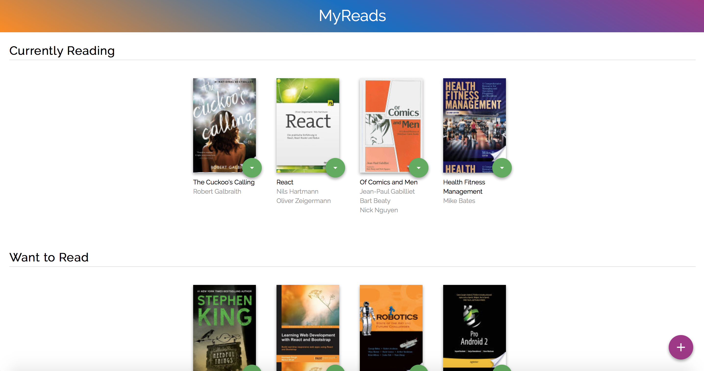
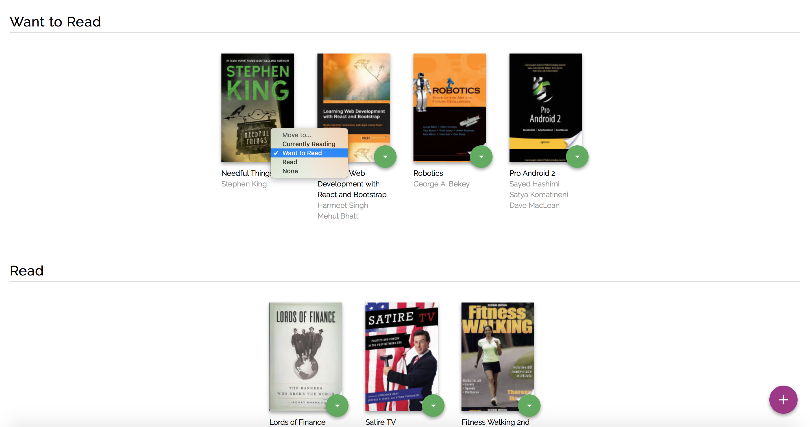
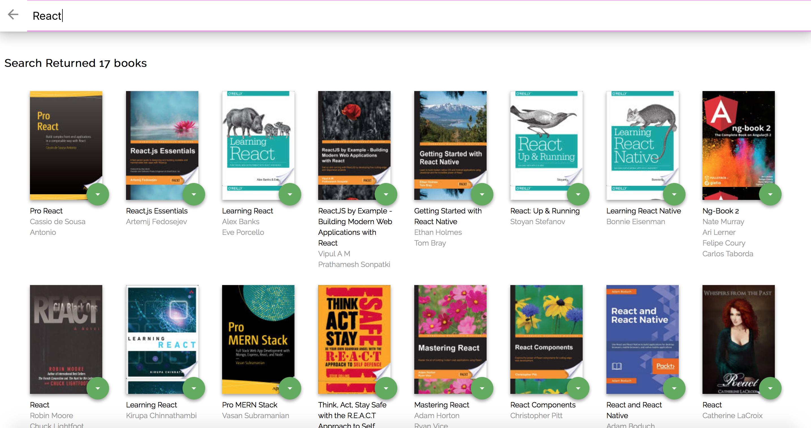

# MyReads: A Book Tracking App Developed In React

## Project Purpose:

MyReads is a bookshelf app that allows us to select and categorize books that we have read, currently reading, or want to read. The project emphasizes using React Fundamentals to build the application and provides an API server and client library to persist information as we interact with the application.

## Project Review:

This project has been reviewed by the Udacity project evaluator. You can read the whole review [Here](https://review.udacity.com/#!/reviews/1172349/shared)

## How to Load the App

The project uses Node.js and the Create-React-App starter.  If you do not have Node >= 6.x installed, you can download it here: [Node.js](https://nodejs.org/en/)

Once Node is installed, navigate to the directory where you want to save the app
```sh
git clone https://github.com/planetpratik/MyReads.git
```
You can use ```npm``` or ```yarn``` package manager to install dependencies.
### ```npm install``` or ```yarn install```

Once all of the dependencies have been installed you can launch the development server with

### ```npm start```  or  ```yarn start```

A new browser window should automatically open displaying the app.  If it doesn't, navigate to [http://localhost:3000/](http://localhost:3000/) in your browser



## How to Use the App
* Books are sorted into three categories:
"Currently Reading", "Want to Read" and "Read".
* Every book features green button to change the shelf of the book. Setting option to none hides the book from the shelf.


* New Book can be added to the shelf using pink + button given at the bottom right corner.

*Note: The backend API is limited to a fixed set of [search terms](#search-terms)  -- see below for valid search options*



### Resources and Documentation:
* [Create-react-app Documentation](https://github.com/facebookincubator/create-react-app)
* [React Router Documentation](http://knowbody.github.io/react-router-docs/)
* [Project starter template](https://github.com/udacity/reactnd-project-myreads-starter)
* [Project Rubric](https://review.udacity.com/#!/rubrics/918/view)
* [Sarah Maris's Project Readme.md](https://github.com/sarah-maris/reactnd-project-myreads/blob/master/README.md)


#### Search Terms
'Android', 'Art', 'Artificial Intelligence', 'Astronomy', 'Austen', 'Baseball', 'Basketball', 'Bhagat', 'Biography', 'Brief', 'Business', 'Camus', 'Cervantes', 'Christie', 'Classics', 'Comics', 'Cook', 'Cricket', 'Cycling', 'Desai', 'Design', 'Development', 'Digital Marketing', 'Drama', 'Drawing', 'Dumas', 'Education', 'Everything', 'Fantasy', 'Film', 'Finance', 'First', 'Fitness', 'Football', 'Future', 'Games', 'Gandhi', 'Homer', 'Horror', 'Hugo', 'Ibsen', 'Journey', 'Kafka', 'King', 'Lahiri', 'Larsson', 'Learn', 'Literary Fiction', 'Make', 'Manage', 'Marquez', 'Money', 'Mystery', 'Negotiate', 'Painting', 'Philosophy', 'Photography', 'Poetry', 'Production', 'Programming', 'React', 'Redux', 'River', 'Robotics', 'Rowling', 'Satire', 'Science Fiction', 'Shakespeare', 'Singh', 'Swimming', 'Tale', 'Thrun', 'Time', 'Tolstoy', 'Travel', 'Ultimate', 'Virtual Reality', 'Web Development', 'iOS'


## License:
MIT License

Copyright (c) 2018 Udacity, Pratik Chougule

Permission is hereby granted, free of charge, to any person obtaining a copy
of this software and associated documentation files (the "Software"), to deal
in the Software without restriction, including without limitation the rights
to use, copy, modify, merge, publish, distribute, sublicense, and/or sell
copies of the Software, and to permit persons to whom the Software is
furnished to do so, subject to the following conditions:

The above copyright notice and this permission notice shall be included in all
copies or substantial portions of the Software.

THE SOFTWARE IS PROVIDED "AS IS", WITHOUT WARRANTY OF ANY KIND, EXPRESS OR
IMPLIED, INCLUDING BUT NOT LIMITED TO THE WARRANTIES OF MERCHANTABILITY,
FITNESS FOR A PARTICULAR PURPOSE AND NONINFRINGEMENT. IN NO EVENT SHALL THE
AUTHORS OR COPYRIGHT HOLDERS BE LIABLE FOR ANY CLAIM, DAMAGES OR OTHER
LIABILITY, WHETHER IN AN ACTION OF CONTRACT, TORT OR OTHERWISE, ARISING FROM,
OUT OF OR IN CONNECTION WITH THE SOFTWARE OR THE USE OR OTHER DEALINGS IN THE
SOFTWARE.
